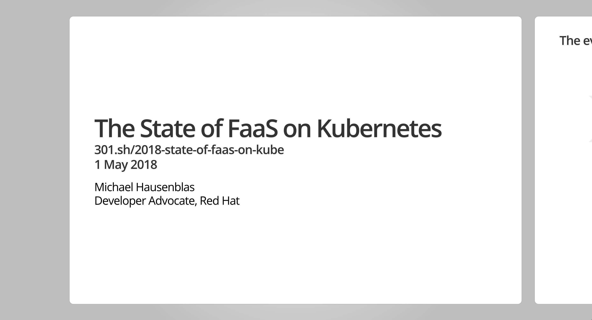

# The State Of FaaS on Kubernetes

This is my KubeCon Europe 2018 [Lightning Talk: The State Of FaaS on Kubernetes](https://kccnceu18.sched.com/event/Dqwe/lightning-talk-the-state-of-faas-on-kubernetes-michael-hausenblas-red-hat-beginner-skill-level). Comments in form of issues as well as concrete suggestions what to add via PRs are welcome.

To view this presentation locally, you'll need to have Go installed as well the [present](https://godoc.org/golang.org/x/tools/present) tool. Then you can use it as follows to view the deck:

```bash
$ git clone https://github.com/mhausenblas/2018-state-of-faas-on-kube.git && cd 2018-state-of-faas-on-kube
$ present
2018/04/13 09:10:02 Open your web browser and visit http://127.0.0.1:3999
2018/04/13 09:10:12 accepting connection from: 127.0.0.1:59357
```

When you now visit http://127.0.0.1:3999 in your browser select `main.slide` and you should see something like the following:



Note that if you plan to send in a PR, please do so against `main.slide` and if you have a screen shot or any other visual, please do place them into the `img/` directory.

